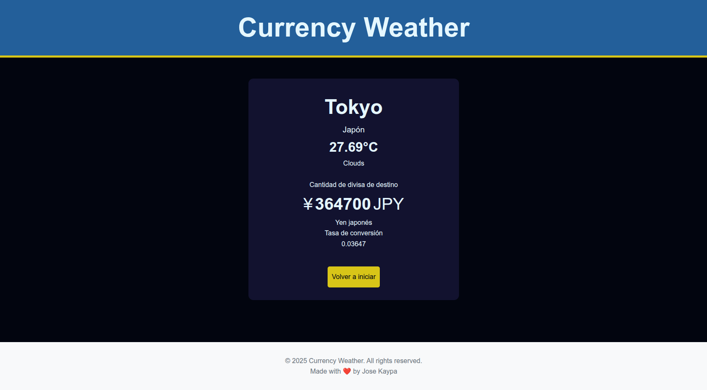
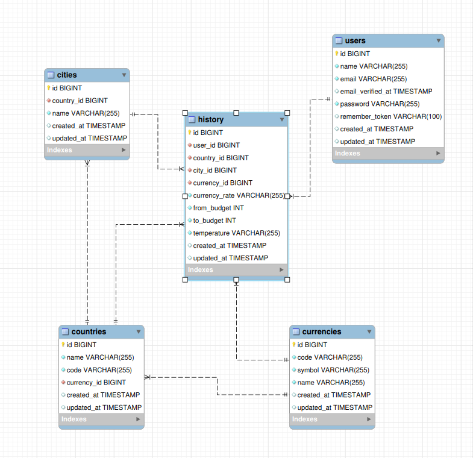

# Weather-Currency

Aplicación Full‑Stack que permite a un usuario autenticarse, elegir destino (país/ciudad), consultar el clima y convertir monedas en una sola vista.

## Stack y estructura
- Frontend: Angular (interceptores, guards, rutas).
- Backend: Laravel (API REST) + Sanctum (tokens).
- Base de datos: MySQL/SQLite.
- Integraciones: OpenWeather y ExchangeRate-API.

Estructura del repo:
- api/ → Backend Laravel
- client/ → Frontend Angular

## Seguridad y rutas protegidas
- Backend (Laravel Sanctum):
  - Protegidas con `auth:sanctum`: `GET /api/user`, `GET /api/destination`, `POST /api/weather-currency`.
- Frontend (Angular):
  - Interceptor agrega `Authorization: Bearer <token>` a cada request.
  - Guard `authGuard` protege rutas: `/` (Country), `/budget`, `/weather-currency`.
  - Rutas públicas: `/login`, `/register`.

## Endpoints principales (API)
- POST `/api/register` → Crea usuario y devuelve `{ access_token, user }`.
- POST `/api/login` → Autentica y devuelve `{ access_token, user }`.
- POST `/api/logout` → Revoca el token actual.
- GET `/api/user` (auth) → Retorna usuario autenticado.
- GET `/api/destination` (auth) → Países con currency y sus cities.
- POST `/api/weather-currency` (auth)
  - Body: `{ city, amount, base, target }`
  - Respuesta: `{ temperature, weather, conversionRate, conversionResult }`

Variables de entorno requeridas (API):
- `WEATHER_API_KEY`
- `EXCHANGE_RATE_API_KEY`

## Relaciones de base de datos
- `Currency` 1—N `Country`
- `Country` 1—N `City`
- `History` N—1 (`User`, `Country`, `City`, `Currency`)

Modelos principales: Country, City, Currency, History. Migraciones incluidas para `countries` y `cities` (con claves foráneas y borrado en cascada).

## Puesta en marcha
Backend (api/):
1) Copiar `.env` y configurar DB y claves de API
2) `composer install`
3) `php artisan key:generate`
4) `php artisan migrate --seed` (si aplica)
5) `php artisan serve`

Frontend (client/):
1) `npm install`
2) `ng serve`
3) Abrir `http://localhost:4200/`

